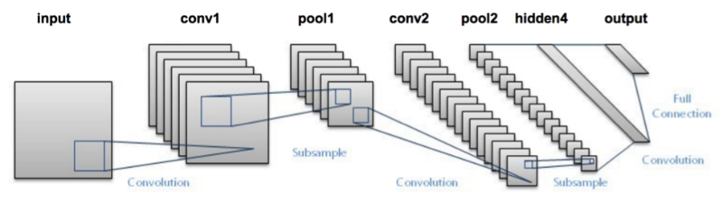
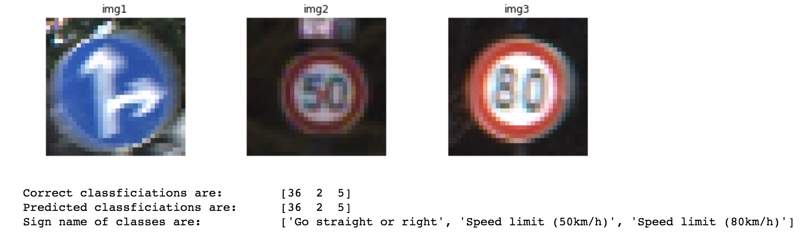

# Traffic_Sign_Classifier

1. Data Exploration/ Preprocess Data
2. CNN Architecture
3. Setting training Pipeline / Model Evaluation
4. Train / Test results

### 1. Data Exploration/ Preprocess Data

I have shuffled data to prevent the case wher only similar traffic signs would be assigned to a batch. I have set training, valid, test to be around 60, 15, 25.

### 2. CNN Archictecture
I have used 1x1 convolution at the beginning of architecture in order to train neurons for colorspace (depth of 3). Then, I added two sets of convolution, activation, and pooling process. Activation function allows non-linear components in training neurons, while max pooling reduces the size of neurons and focuses on neurons that seem to matter most.
1) Convolution took input of (32x32x3) and generated output of (28x28x6) by having filter size 5x5 with stride of 1 and valid padding. Then in pooling, its size got halved to (14x14x6) with stride of 2.
2) Second set of convolution took input of (14x14x6) and had output of (10x10x16) with stride of 1. Then in pooling, its size got halved to (5x5x16).
3) Then, in 3rd layer, it's got flatten to 400 neurons and got connected to a layer of 120 neurons. I have addded dropout afterwards in order to reduce overfitting. Then I added two additional layers which have finally reduced the output to be size of 43.

### 3. Training Pipeline 

I have set learning rate to be 0.0008 and increased epoch to be 18. I used adam optimizer with cross entropy cost function. 

### 4. Train / Test Results
Validation accuracy comes out to be 0.984, while test accuracy is 0.933

### Output

